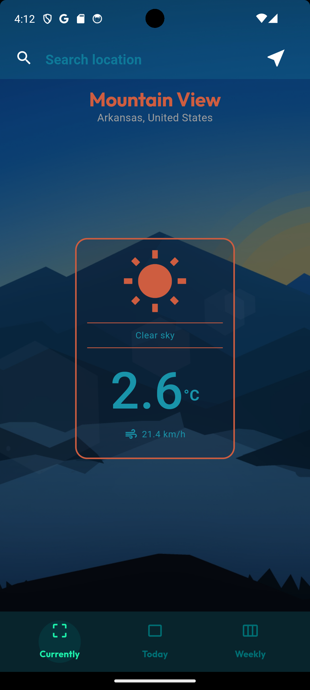
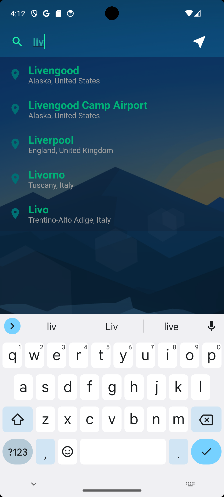

# Weather App

*A Flutter project focused on mobile **structure and logic**, **Api handling** and **UI/UX**.*

---

| Current weather | Daily weather | Weekly weather |
| --- | --- | --- |
|  |  |  |

## Geolocalisation

To access GPS device information, I added the [geolocator](https://pub.dev/packages/geolocator) Dart package, *version 8.2.0.* Before using the geolocator package, there are certain prerequisites to ensure :

**Connectivity** : The device must be connected to a network. To check this, I used the [connectivity_plus: ^5.0.2 package](https://pub.dev/packages/connectivity_plus), to create a **`provider`** in order to have real-time notifications in case of connection loss (e.g., when the device is in airplane mode).

**User authorization**: To use GPS, the user must be informed and asked for permission. The geolocator package handles this in the following code :  

```dart
Future<Position> _determinePosition() async {
    bool serviceEnabled;
    PermissionStatus permission;

    serviceEnabled = await Geolocator.isLocationServiceEnabled();
    if (!serviceEnabled) {
      return Future.error('Location services are disabled.');
    }

    permission = await Permission.location.status;
    if (permission == PermissionStatus.denied) {
      permission = await Permission.location.request();
      if (permission == PermissionStatus.denied) {
        return Future.error('Location permissions are denied');
      }
    }

    if (permission == PermissionStatus.permanentlyDenied) {
      return Future.error('Location permissions permanently denied.');
    }
    
    _permissionStatus = permission;
    _isLocationEnabled = permission == PermissionStatus.granted;
    _afterInitCallBack();

    return await Geolocator.getCurrentPosition();
  }
```

> *Note*  
for **connectivity** and **GPS** access, there is also lines to add in the emulators settings Android or iOS.


## API Fetch
- API call [Fetch data from the internet - official flutter](https://docs.flutter.dev/cookbook/networking/fetch-data)
- API1 Geocoding -> get coordinates + ciies from a name/searchinput open-meteo [API](https://open-meteo.com/en/docs/geocoding-api)

## Provider

- Flutter [InheritedWidget](https://api.flutter.dev/flutter/widgets/InheritedWidget-class.html) class -> conclusion use [Provider](https://pub.dev/packages/provider) instead
- Provider [Video](https://www.youtube.com/watch?v=FUDhozpnTUw)

## Environnement secrets - API Key
- API2 Reverse geocoding **openweathermap** from [coordinates](https://openweathermap.org/api/geocoding-api)
- Make API **key** for **openweathermap** need make free account
- Put **API Key in .env** then access into flutter [cet article semble bien](https://dev.to/namankk/securely-storing-api-keys-in-flutter-3ko4) (envied 3 packages) 

## JSON Serialization
- forecastAPI -> lot of data to serialize with json package + files to generate with `flutter pub run build_runner build`


## NEXT STEPS
- connectivity (check if connected to a network) package + need line to add to manifest for emulator enable access

## charts
- fl_chart package (temp charts)


| Coordinates from device GPS | Browse city names through an Api |
| --- | --- |
|  |  |