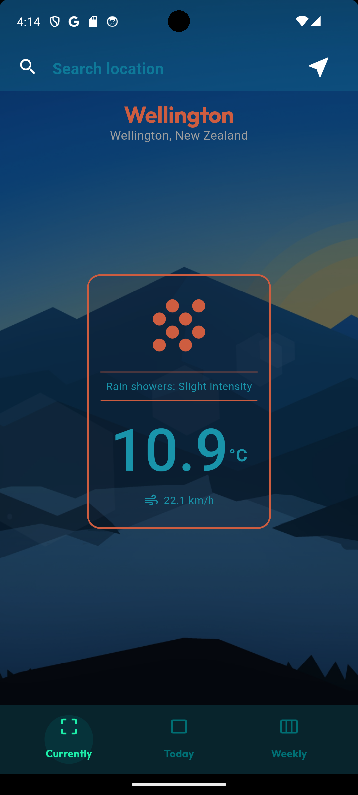
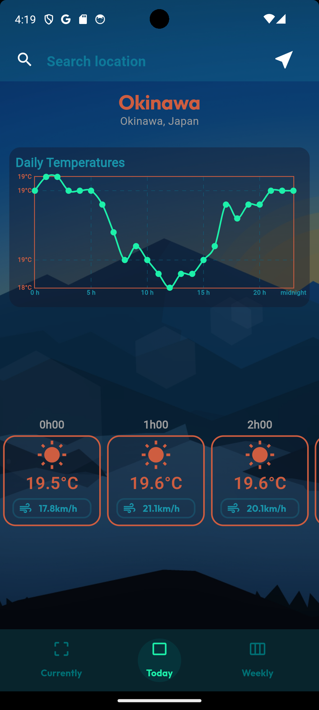
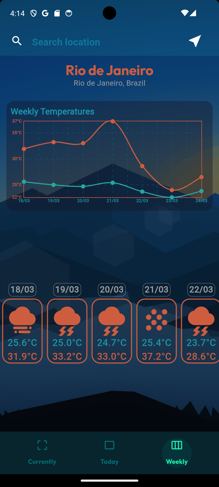
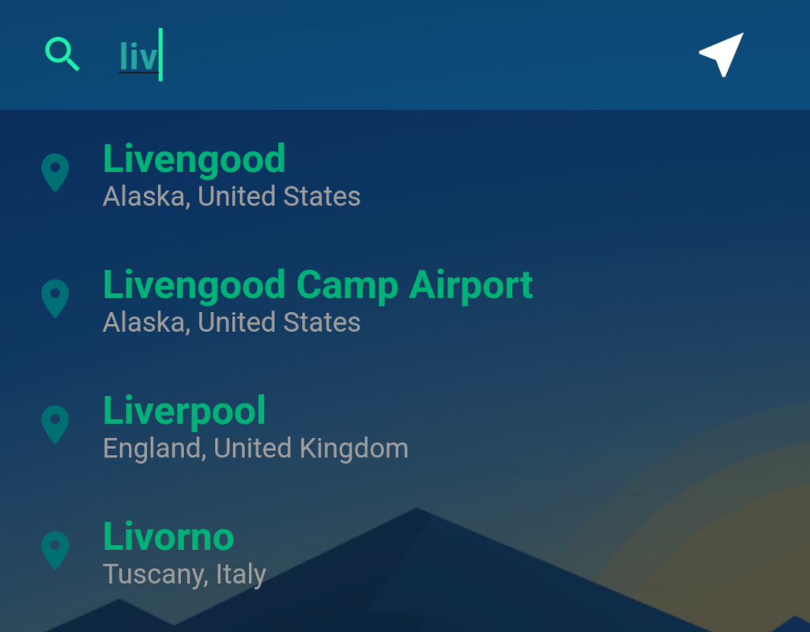
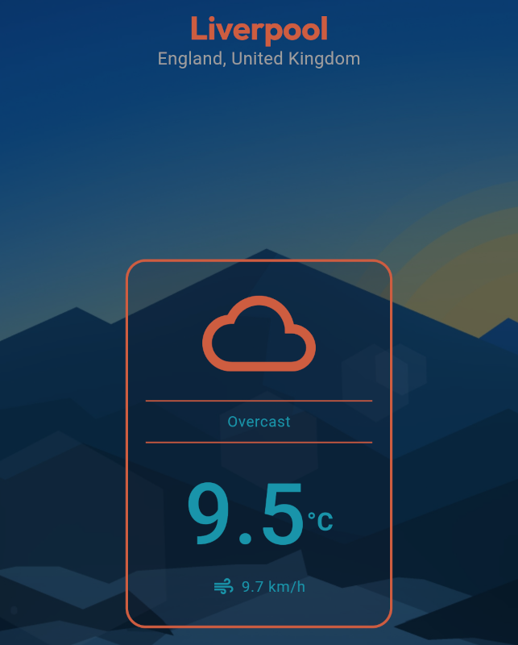
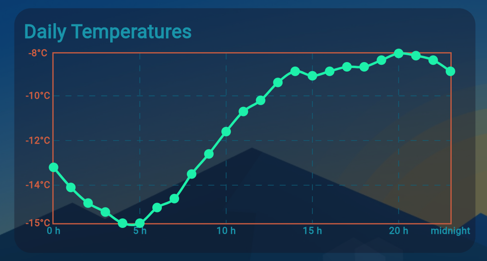
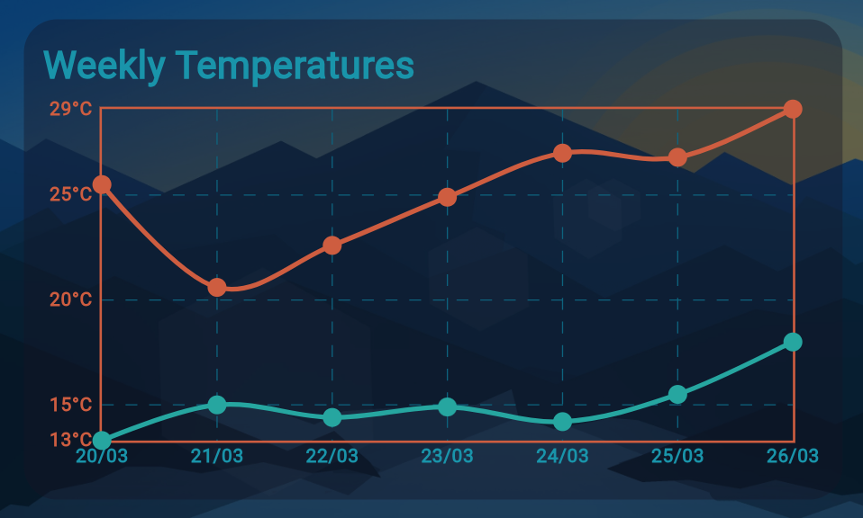
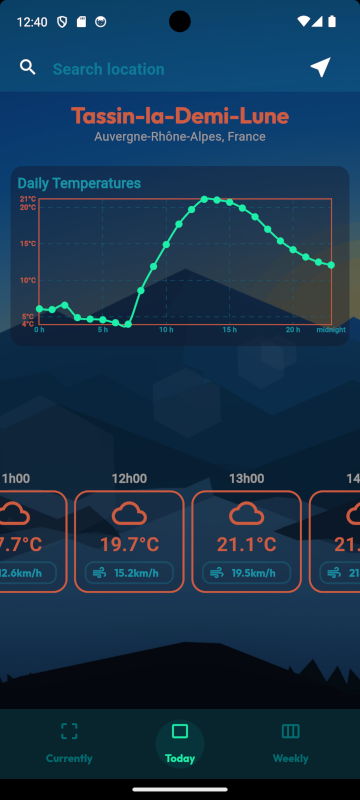
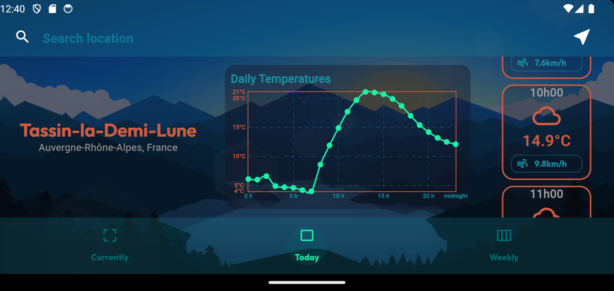

# Weather App

*A Flutter project focused on mobile **structure and logic**, **Api handling** and **UI/UX**.*

---

| Current weather | Daily weather | Weekly weather |
| --- | --- | --- |
|  |  |  |

## Geolocalisation

To access GPS device information, I added the [geolocator](https://pub.dev/packages/geolocator) Dart package, *version 8.2.0.* Before using the geolocator package, there are certain prerequisites to ensure :

**Connectivity** : The device must be connected to a network. To check this, I used the [connectivity_plus: ^5.0.2 package](https://pub.dev/packages/connectivity_plus), to create a **`provider`** in order to have real-time notifications in case of connection loss (e.g., when the device is in airplane mode).

**User authorization**: To use GPS, the user must be informed and asked for permission. The geolocator package handles this in the following code :  

```dart
Future<Position> _determinePosition() async {
    bool serviceEnabled;
    PermissionStatus permission;

    serviceEnabled = await Geolocator.isLocationServiceEnabled();
    if (!serviceEnabled) {
      return Future.error('Location services are disabled.');
    }

    permission = await Permission.location.status;
    if (permission == PermissionStatus.denied) {
      permission = await Permission.location.request();
      if (permission == PermissionStatus.denied) {
        return Future.error('Location permissions are denied');
      }
    }

    if (permission == PermissionStatus.permanentlyDenied) {
      return Future.error('Location permissions permanently denied.');
    }
    
    _permissionStatus = permission;
    _isLocationEnabled = permission == PermissionStatus.granted;
    _afterInitCallBack();

    return await Geolocator.getCurrentPosition();
  }
```

> *Note*  
for **connectivity** and **GPS** access, there is also lines to add in the emulators settings Android or iOS.


## API Fetch

[Fetch data from the internet](https://docs.flutter.dev/cookbook/networking/fetch-data) from flutter documentation, has all we need to getting started.  

Use of `http` [package](https://pub.dev/packages/http) and `async` / `await` asynchronous management with `Future` core dart class.
*The [**GeoFetcher class**](./lib/tools/geo_fetcher.dart), centralizes all project API calls.*

```dart
Future<String> _fetchCityNameByCoordinates(double lat, double long) async {
    const baseUrl = 'https://api.openweathermap.org/geo/1.0/reverse';
    final apiKey = Env.weatherOrgApiKey;

    final params = <String, String>{
      'lat': lat.toString(),
      'lon': long.toString(),
      'limit': '1',
      'appid': apiKey,
    };

    final uri = Uri.parse(baseUrl).replace(queryParameters: params);

    final response = await http.get(uri);

    if (response.statusCode == 200) {
        // ...
```

Then a [`FutureBuilder`](https://api.flutter.dev/flutter/widgets/FutureBuilder-class.html) widget can update the display based on the state of the Future object.  

**WeatherApp** uses the [**OpenMeteo APIs**](https://open-meteo.com/en/docs/geocoding-api) in two steps:
 1. Retrieve a list of city names with their coordinates based on a search term.
 2. Retrieve the weather data for the selected city.

 | 1. Browse cities | 2. Get weather |
| --- | --- |
|  |   |

## API Key

I needed to perform reverse geocoding, which involves retrieving a city name from GPS coordinates, latitude and longitude. That's why I used the [OpenWeather API](https://openweathermap.org/api/geocoding-api), which required an `API key` obtained by creating a free account.

For security and (bonnes pratiques/habitudes) concerns, the api key must kept secret in a .env file and not published in commits. I followed this article showing how to access environnement variables from the .env into the flutter project.
This involved of using the following three packages in order to generate the env.g.dart file.  

To comply with security and best practices, the API key should be kept secret in a .env file and not published in commits. I followed this [article](https://dev.to/namankk/securely-storing-api-keys-in-flutter-3ko4) that shows how to access environment variables from the .env file in a Flutter project. This involved using the following three packages to generate the env.g.dart file.  

```yaml
dependencies:
  envied: ^0.5.3
  envied_generator: ^0.5.3

dev_dependencies:
  build_runner: ^2.4.8
```

## Provider

To pass data from a parent widget to a child widget, it can be passed as a parameter. However, when the widgets involved are distant in the widget tree, a more modular method is required.

In searching for the most common methods used by Flutter to share data between distant widgets, I discovered a first approach using [`InheritedWidget`](https://api.flutter.dev/flutter/widgets/InheritedWidget-class.html). However, the documentation concludes that it is better to use [`providers`](https://pub.dev/packages/provider) instead. This [video](https://www.youtube.com/watch?v=FUDhozpnTUw) from Flutter Mapp gave me a first approach.

CREATE  

```dart
// a provider is a class inherited from ChangeNotifier class
class City extends ChangeNotifier {
  String _name = '';

  String get name => _name;

  void setName(String name) {
    _name = name;
    notifyListeners(); // This notify is required to share update in real-time
  }
}
```

INSTANCIATE

```dart
void main() {
  runApp(
    ChangeNotifierProvider(
      create: (context) => City(),
      child: MyApp(),
    ),
  );
}
```

USE (RAW METHOD)

```dart
 // in a widget build method (need context)
    // read to only get data without listen it:
 final City initialCity = Provider.of<City>(context, listen: false).read;
    // watch to listen any changes:
 final City updatedInRealTimeCity = Provider.of<User>(context).watch;
    // use our custom methods:
 Provider.of<Counter>(context, listen: false).setName("newName");
```

USE (CONSUMER METHOD)

```dart
 @override
    Widget build(BuildContext context) {
    return Consumer<City>(
        builder: (context, city, child) {
        return Text('City: ${city.name}');
        },
    );
  }
```

## JSON Serialization

To use the JSON data of weather forecast given by the [**OpenMeteo forecast API**](https://open-meteo.com/en/docs) we need to convert the JSON into an object. This process is called [JSON serialization](https://docs.flutter.dev/data-and-backend/serialization/json).

In order to create these objects, the [WeatherData](./lib/models/weather_data.dart) class is built based on the JSON content.  
The class needs methods to convert `fromJson` and `toJson`.  
These methods can be implemented manually, but there is tools to deal with : [json_serializable](https://pub.dev/packages/json_serializable) and [json_annotation](https://pub.dev/packages/json_annotation).  
Here are the dependencies we need to add to our pubspec.yaml file:  

```yaml
dependencies:
  json_annotation: ^4.8.1

dev_dependencies:
  json_serializable: ^6.7.1
```

The dev dependencie build_runner is also used to generate the weather_data.g.dart using  
`flutter pub run build_runner build`  
The class only needs a few `@property wrappers` to being seriazable.


```dart
part 'weather_data.g.dart'; // the generated file

@JsonSerializable() // from json_annotation
class WeatherData {
  final double latitude;
  final double longitude;
  @JsonKey(name: 'generationtime_ms') // from json_annotation
  final double generationtimeMs;
  //...
```

## CHARTS

To build charts quickly and easily, I used the [fl_chart](https://pub.dev/packages/fl_chart) package.


| Daily temperatures | Weekly temperatures min & max |
| --- | --- |
|  |  |

## FEW RESPONSIVE DESIGN ELEMENTS

To know if the device is in `portrait` or `landscape` orientation, we can read with the build context with MediaQuery:  

```dart
Orientation orientation = MediaQuery.of(context).orientation;
```

Then, I took advantage of the benefits provided by the [Wrap widget](https://api.flutter.dev/flutter/widgets/Wrap-class.html) to distribute object in row or column depending on allowed space and device orientation.

```dart
Wrap(
    direction: orientation == Orientation.landscape
        ? Axis.horizontal
        : Axis.vertical,
    crossAxisAlignment: orientation == Orientation.landscape
        ? WrapCrossAlignment.start
        : WrapCrossAlignment.center,
    alignment: WrapAlignment.center,
    spacing: MediaQuery.of(context).size.height * 0.05,
    runSpacing: 20.0,
    children: orientation == Orientation.landscape
        ? landscapeChildren
        : portraitChildren
    ),
```

| Portrait | Landscape |
| --- | --- |
|  |  |